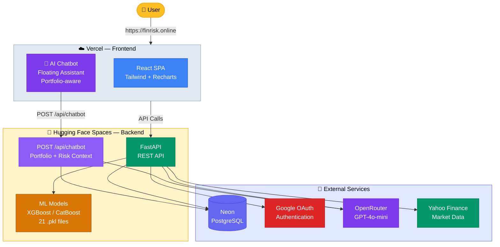

# FinRisk: AI-Powered Financial Risk Management System

🌐 **Live:** [https://finrisk.online](https://finrisk.online)


[](https://fastapi.tiangolo.com/)
[](https://react.dev/)
[](https://tailwindcss.com/)
[](https://www.postgresql.org/)
[](https://huggingface.co/spaces/AyushSingh15/finrisk-api)

**FinRisk** is a state-of-the-art Financial Risk Management Dashboard that leverages machine learning and AI to provide real-time risk assessment, portfolio intelligence, and actionable recommendations. Designed with a premium glassmorphic UI, it helps investors and institutions monitor market volatility, business risk, liquidity exposures, and more in a single unified interface.

---

## 🏗️ Deployment Architecture



---

## 🎯 Overview

FinRisk transforms complex financial data into actionable insights through:

- **AI-Powered Intelligence**: Holistic portfolio analysis with narrative overviews and specific actionable recommendations generated via GPT-4o-mini (OpenRouter).
- **AI Chatbot Assistant**: Floating financial agent on every page — ask questions about your portfolio, risk scores, asset allocation, and get instant AI-driven advice via natural language.
- **Multi-Module Risk Tracking**: Six specialized risk modules covering every dimension of financial exposure.
- **Dynamic Portfolio Management**: Real-time asset tracking with live price updates from yfinance.
- **Premium User Experience**: Aurora-style animated backgrounds, glassmorphism UI, and smooth page transitions.
- **Secure Authentication**: Integrated Google OAuth and traditional Email/Password login.
- **Instant Notifications**: Real-time alerts for critical risk movements with daily rotating message templates, time-of-day greetings, and smart dedup via localStorage.

---

## ✨ Key Features

### **📊 Risk Modules**

| Module | Description |
|--------|-------------|
| **Credit Risk** | ML-driven default prediction using XGBoost/CatBoost ensemble with probability-based thresholds (Low/Medium/High risk tiers), feature importance explanations |
| **Market Risk** | Value-at-Risk (VaR) estimation using XGBoost Hybrid ML VaR model with 5-year NIFTY 50 training data, tail-risk residual adjustment, confidence level selection (95%/99%) |
| **Business Risk** | Revenue stability and competitive landscape assessment |
| **Operational Risk** | Monitoring of system-wide failures and process risks |
| **Financial Risk** | Capital structure and leverage analysis |
| **Liquidity Risk** | Cash-flow stability and funding risk assessment |
| **E-Commerce Fraud** | Transaction-level fraud detection for digital payments |

### **🤖 AI Intelligence**

- Portfolio Overview: 2-3 sentence narrative analysis
- Actionable Recommendations: Prioritized steps to improve portfolio health
- Risk Alerts: Proactive notifications for critical movements
- **Floating Chatbot**: Conversational AI assistant on every page — answers queries about portfolio holdings, risk levels, diversification, and market exposure using real user data

### **📈 Portfolio Tracking**

- Real-time price updates via yfinance
- Asset allocation visualization (Pie charts)
- Performance tracking with P/L calculations
- Correlation matrix for diversification analysis

### **🔒 Security**

- **Rate Limiting**: API endpoints protected with rate limits (10 req/min for predictions, 20 req/min for chatbot, 10 req/min for auth)
- **Security Headers**: `X-Frame-Options: DENY`, `X-Content-Type-Options: nosniff`, `Strict-Transport-Security`, `Permissions-Policy`, `Referrer-Policy`
- **Input Validation**: Pydantic-based request validation across all prediction endpoints
- **Authentication**: Google OAuth with credential verification
- **CORS**: Strictly scoped to allowed frontend origins
- **Password Hashing**: Bcrypt for stored credentials

### **🔍 SEO**

- **Per-Page Meta Tags**: Unique title, description, Open Graph, and Twitter Card tags for all 16 pages
- **SEO Component**: Reusable `<SEO>` component using `react-helmet-async` for dynamic `<head>` management
- **Sitemap**: `sitemap.xml` with all routes and priorities for search engine crawling
- **Robots.txt**: Proper crawl directives pointing to sitemap
- **Canonical URLs**: Every page has a self-referencing canonical link

---

## 🛠️ Technical Stack

### **Frontend**
| Technology | Purpose |
|------------|---------|
| React 19 + Vite | Modern reactive UI framework |
| Tailwind CSS | Utility-first styling |
| Recharts | Data visualization (charts, graphs) |
| Lucide React | Consistent icon library |
| Framer Motion | Smooth page transitions |
| Axios | HTTP client for API calls |
| react-helmet-async | Dynamic SEO meta tags per page |

### **Backend**
| Technology | Purpose |
|------------|---------|
| FastAPI | High-performance Python web framework |
| SQLAlchemy | Database ORM |
| PostgreSQL (Neon) | Serverless cloud database |
| OpenRouter API | AI-powered analysis (Gemini) |
| Google OAuth | Secure authentication |
| Bcrypt | Password hashing |
| yfinance | Real-time market data |
| Hugging Face Spaces | Docker-based backend hosting (always-on) |
| slowapi | Rate limiting for API endpoints |

---

## 🗄️ Database Design

### Overview

The system uses **Neon PostgreSQL** (production) with **SQLite** fallback for local development. All models are defined via **SQLAlchemy ORM** (`Backend/models.py`) and managed through declarative base. The schema is normalized to **3NF** with 11 tables.

### Connection Configuration (`Backend/database.py`)

| Setting | Production (Neon PostgreSQL) | Local Dev (SQLite) |
|---------|------------------------------|-------------------|
| Pool Size | 5 connections | N/A |
| Max Overflow | 10 connections | N/A |
| Pool Pre-Ping | Enabled (stale connection detection) | N/A |
| Pool Recycle | 300 seconds | N/A |
| SSL | `sslmode=require` | N/A |
| Thread Safety | `check_same_thread=False` | Required for SQLite |

### Entity Relationship Summary

```
users (1) ──┬── (N) portfolio
            ├── (N) credit_predictions
            ├── (N) market_risk_data
            ├── (N) business_risk
            ├── (N) liquidity_risk
            ├── (N) financial_risk
            └── (N) fraud_predictions
```

### Table Schemas

#### `users` — User accounts & authentication

| Column | Type | Constraints | Description |
|--------|------|------------|-------------|
| `id` | `Integer` | `PK, INDEX` | Auto-increment user ID |
| `name` | `String(100)` | `NULLABLE` | Display name |
| `email` | `String(100)` | `UNIQUE, NOT NULL, INDEX` | Login identifier |
| `password_hash` | `String(255)` | `NOT NULL` | Bcrypt hashed password |
| `age` | `Integer` | `NULLABLE` | User age |
| `risk_profile` | `String(20)` | `NULLABLE` | Risk preference (Low/Medium/High) |
| `is_verified` | `Boolean` | `default=False` | Email verification status |
| `verification_token` | `String(255)` | `NULLABLE` | Email verification token |
| `created_at` | `DateTime(tz)` | `server_default=now()` | Registration timestamp |

*Normalization:* 3NF. Email is a candidate key separate from the surrogate `id` PK. Profile fields kept in the same table (no 1:1 split) because access pattern always fetches user + profile together.

---

#### `portfolio` — User investment holdings

| Column | Type | Constraints | Description |
|--------|------|------------|-------------|
| `id` | `Integer` | `PK, INDEX` | Auto-increment ID |
| `user_id` | `Integer` | `FK → users.id` | Owner |
| `asset_name` | `String` | — | Ticker/symbol (e.g. AAPL, BTC) |
| `asset_type` | `String` | — | stock, crypto, etf, etc. |
| `quantity` | `Float` | — | Number of units held |
| `buy_price` | `Float` | — | Average buy price |
| `current_price` | `Float` | — | Latest market price (from yfinance) |
| `total_value` | `Float` | — | `quantity × current_price` (denormalized for fast aggregation) |
| `created_at` | `DateTime(tz)` | `server_default=now()` | Added timestamp |

*Normalization:* 3NF. `total_value` is intentionally denormalized to avoid repeated multiplication on every dashboard load (the dashboard aggregates all portfolio values). Updated on price refresh.

*Access pattern:* Dashboard stats endpoint `SELECT total_value WHERE user_id = ?` runs in parallel with other queries.

---

#### `credit_applications` — Raw credit application features

| Column | Type | Description |
|--------|------|-------------|
| `id` | `Integer PK` | Auto-increment |
| `income`, `credit`, `annuity` | `Float` | Financial inputs |
| `goods_price` | `Float` | Price of goods being financed |
| `children`, `family_members` | `Integer` | Family composition |
| `age` | `Float` | Applicant age |
| `employment_years` | `Float` | Years in current job |
| `ext1–ext3` | `Float` | External risk scores (bureau) |
| `ext_mean`, `ext_std`, `ext_min`, `ext_max` | `Float` | Aggregated external features |
| `credit_income_ratio` | `Float` | Engineered: `credit / income` |
| `annuity_income_ratio` | `Float` | Engineered: `annuity / income` |
| `credit_term` | `Float` | Engineered loan term proxy |
| `income_per_child` | `Float` | Engineered: `income / children` |
| `credit_goods_ratio` | `Float` | Engineered: `credit / goods_price` |
| `bureau_year`, `bureau_week`, `bureau_month` | `Float` | Bureau query recency |
| `def30`, `def60` | `Float` | Days past due (30/60) |

*Purpose:* Stores raw features before model inference. Used for reproducibility and audit trails.

---

#### `credit_predictions` — Credit risk model output

| Column | Type | Constraints | Description |
|--------|------|------------|-------------|
| `id` | `Integer` | `PK, INDEX` | Auto-increment |
| `user_id` | `Integer` | `FK → users.id, NULLABLE, INDEX` | User who requested prediction |
| `application_id` | `Integer` | — | Link to source `credit_applications` |
| `risk_score` | `Float` | — | Default probability (0–1) |
| `risk_label` | `String(20)` | — | Low / Medium / High Risk |
| `confidence` | `Float` | — | Model confidence |
| `predicted_at` | `DateTime(tz)` | `server_default=now()` | Prediction timestamp |

*Index:* `user_id` is indexed for fast "latest prediction per user" lookups on the dashboard.

---

#### `market_risk_data` — Market VaR predictions

| Column | Type | Constraints | Description |
|--------|------|------------|-------------|
| `id` | `Integer` | `PK, INDEX` | Auto-increment |
| `user_id` | `Integer` | `FK → users.id, NULLABLE, INDEX` | User |
| `symbol` | `String(20)` | — | Market index/symbol |
| `open_price`–`low_price` | `Float` | — | OHLC data |
| `volume` | `BigInteger` | — | Trading volume |
| `risk_score` | `Float` | — | VaR value (monetary loss) |
| `risk_level` | `String(50)` | — | Low / Medium / High |
| `recorded_at` | `DateTime(tz)` | `server_default=now()` | Timestamp |

---

#### `business_risk` — Business risk assessments

| Column | Type | Constraints | Description |
|--------|------|------------|-------------|
| `id` | `Integer` | `PK, INDEX` | Auto-increment |
| `user_id` | `Integer` | `FK → users.id, NULLABLE, INDEX` | User |
| `revenue` | `Float` | — | Annual revenue |
| `expenses` | `Float` | — | Annual expenses |
| `competition_level` | `String(50)` | — | Low / Medium / High |
| `growth_rate` | `Float` | — | Year-over-year growth |
| `risk_score` | `Float` | — | Risk probability (0–1) |
| `risk_level` | `String(20)` | — | Risk category |
| `recorded_at` | `DateTime(tz)` | `server_default=now()` | Timestamp |

---

#### `liquidity_risk` — Liquidity/cash-flow risk

| Column | Type | Constraints | Description |
|--------|------|------------|-------------|
| `id` | `Integer` | `PK, INDEX` | Auto-increment |
| `user_id` | `Integer` | `FK → users.id, NULLABLE` | User |
| `assets` | `Float` | — | Total liquid assets |
| `liabilities` | `Float` | — | Short-term liabilities |
| `cash_flow` | `Float` | — | Operating cash flow |
| `liquidity_ratio` | `Float` | — | `assets / liabilities` |
| `risk_score` | `Float` | — | Risk score |
| `risk_label` | `String(50)` | — | Risk level |
| `created_at` | `DateTime(tz)` | `server_default=now()` | Timestamp |

---

#### `financial_risk` — Financial/capital structure risk

| Column | Type | Constraints | Description |
|--------|------|------------|-------------|
| `id` | `Integer` | `PK, INDEX` | Auto-increment |
| `user_id` | `Integer` | `FK → users.id, NULLABLE` | User |
| `income` | `Float` | — | Income |
| `debt` | `Float` | — | Total debt |
| `assets` | `Float` | — | Total assets |
| `financial_ratio` | `Float` | — | Debt-to-income or similar |
| `risk_score` | `Float` | — | Risk score |
| `risk_label` | `String(50)` | — | Low / Medium / High |
| `created_at` | `DateTime(tz)` | `server_default=now()` | Timestamp |

---

#### `fraud_predictions` — E-commerce fraud detection

| Column | Type | Constraints | Description |
|--------|------|------------|-------------|
| `id` | `Integer` | `PK, INDEX` | Auto-increment |
| `user_id` | `Integer` | `FK → users.id, NULLABLE` | User |
| `amount` | `Float` | — | Transaction amount |
| `payment_method` | `String(50)` | — | Credit Card, PayPal, etc. |
| `product_category` | `String(50)` | — | Electronics, Clothing, etc. |
| `fraud_probability` | `Float` | — | Probability of fraud (0–1) |
| `label` | `String(20)` | — | Fraud / Legitimate |
| `predicted_at` | `DateTime(tz)` | `server_default=now()` | Timestamp |

---

#### `operational_risk` — Operational risk events

| Column | Type | Constraints | Description |
|--------|------|------------|-------------|
| `id` | `Integer` | `PK, INDEX` | Auto-increment |
| `event_type` | `String(50)` | — | Category (e.g. System Failure) |
| `description` | `Text` | — | Free-text event description |
| `severity` | `String(20)` | — | Low / Medium / High / Critical |
| `financial_loss` | `Float` | — | Estimated loss amount |
| `department` | `String(50)` | — | Affected department |
| `risk_score` | `Float` | — | Computed risk score |
| `occurred_at` | `DateTime(tz)` | `server_default=now()` | Event timestamp |

*Note:* Operational risk is tenant-agnostic (no `user_id` FK) — it records system-wide events.

---

#### `ml_predictions` — Generic ML prediction audit log

| Column | Type | Constraints | Description |
|--------|------|------------|-------------|
| `id` | `Integer` | `PK, INDEX` | Auto-increment |
| `model_name` | `String(50)` | — | Model identifier (xgboost, catboost, etc.) |
| `risk_type` | `String(50)` | — | credit, market, fraud, etc. |
| `entity_id` | `Integer` | — | Reference to source record |
| `input_features` | `Text` | — | JSON-serialized feature vector |
| `risk_score` | `Float` | — | Prediction score |
| `risk_label` | `String(20)` | — | Classification label |
| `confidence` | `Float` | — | Model confidence |
| `predicted_at` | `DateTime(tz)` | `server_default=now()` | Timestamp |

---

### Indexes Summary

| Table | Column(s) | Type | Purpose |
|-------|-----------|------|---------|
| `users` | `id` | Primary | Row lookup |
| `users` | `email` | Unique | Auth lookup by email |
| `portfolio` | `id` | Primary | Row lookup |
| `credit_predictions` | `id` | Primary | Row lookup |
| `credit_predictions` | `user_id` | Foreign Key | Dashboard: latest prediction per user |
| `market_risk_data` | `id` | Primary | Row lookup |
| `market_risk_data` | `user_id` | Foreign Key | Dashboard: latest VaR per user |
| `business_risk` | `id` | Primary | Row lookup |
| `business_risk` | `user_id` | Foreign Key | Dashboard: latest assessment per user |
| `liquidity_risk` | `id` | Primary | Row lookup |
| `financial_risk` | `id` | Primary | Row lookup |
| `fraud_predictions` | `id` | Primary | Row lookup |
| `operational_risk` | `id` | Primary | Row lookup |
| `ml_predictions` | `id` | Primary | Row lookup |

### Normalization Level

The schema is **Third Normal Form (3NF)**:

- **1NF**: All columns are atomic (no arrays or JSON blobs except `ml_predictions.input_features` which stores serialized features — intentional for audit flexibility)
- **2NF**: Every non-key column depends on the entire primary key (all tables have single-column surrogate PKs)
- **3NF**: No transitive dependencies. Profile fields (`age`, `risk_profile`) remain in `users` because they are queried together with authentication data in every profile access — splitting would add a join without benefit.

**Deliberate denormalization:**
- `portfolio.total_value` — precomputed `quantity × current_price` to avoid recalculating across N assets on every dashboard load
- `credit_applications` stores both raw inputs AND engineered features (ratios, aggregations) in the same row — this preserves audit trail without requiring feature pipeline replay

### Key Query Patterns

| Pattern | Tables Involved | Frequency |
|---------|----------------|-----------|
| Auth | `users` (WHERE email = ?) | Every request |
| Dashboard | `users` → `portfolio`, `credit_predictions`, `market_risk_data`, `business_risk` | Page load |
| Prediction + History | Risk table (INSERT new row, SELECT latest N for user) | Per prediction |
| Portfolio CRUD | `portfolio` (WHERE user_id = ?) | On interaction |
| Notifications | `fraud_predictions`, `credit_predictions`, `market_risk_data`, `business_risk`, `liquidity_risk`, `financial_risk` (WHERE user_id = ? ORDER BY predicted_at DESC LIMIT 10) | Page load (via notification panel) |

Dashboard queries are now **parallelized** via `ThreadPoolExecutor` (4 workers) — portfolio, credit, market, and business risk lookups run concurrently, cutting wall-clock time from sum-of-latencies to max-of-latencies.

---

## 📂 Project Structure

```
FinRisk/
│
├── Backend/                          # FastAPI REST API
│   ├── main.py                       # App entry, CORS, routers, dynamic notification engine
│   ├── ai_service.py                 # OpenRouter AI integration
│   ├── database.py                   # SQLAlchemy engine setup
│   ├── models.py                    # User, Portfolio, Risk schemas
│   ├── portfolio.py                  # Portfolio CRUD operations
│   │
│   ├── credit_risk_api.py           # Credit risk ML predictions
│   ├── market_risk_api.py           # VaR calculations
│   ├── business_risk_api.py          # Business risk analysis
│   ├── liquidity_risk_api.py         # Liquidity assessment
│   ├── final_financial_api.py        # Financial risk module
│   ├── operational_risk_api.py       # Operational risk scoring
│   ├── E_commerce_fraud_risk_api.py  # Fraud detection
│   │
│   ├── migrate.py                   # DB migration & seeding
│   ├── routes/                      # API route handlers
│   │   └── market.py               # Market data endpoints
│   │
│   ├── .env                        # Environment variables
│   ├── requirements.txt             # Python dependencies
│   ├── test_db.py                   # Test database utilities
│   └── README.md                   # Backend documentation
│
├── Models/                           # Trained ML Models
│   ├── credit_risk_catboost.pkl    # Credit risk CatBoost model (production)
│   ├── credit_risk_xgboost_model.pkl # Credit risk XGBoost model
│   ├── fraud_detection_model.pkl    # Fraud detection model
│   └── ...
│
├── Notebooks/                        # Research & Training
│   ├── Credit Risk(main).ipynb    # CatBoost credit risk training
│   ├── Credit Risk 2.ipynb          # Additional analysis
│   ├── Fraud_Detection.ipynb       # Fraud model training
│   └── ...
│
├── React Frontend/                   # React Dashboard
│   ├── public/
│   │   └── vite.svg               # Vite default logo (unused)
│   │
│   ├── src/
│   │   ├── components/            # Reusable UI components
│   │   │   ├── Navbar.jsx         # Top navigation bar
│   │   │   ├── Sidebar.jsx        # Collapsible sidebar nav
│   │   │   ├── NotificationPanel.jsx  # Notifications dropdown (mark-read, clear-all, localStorage dedup)
│   │   │   ├── ProtectedRoute.jsx  # Auth guard component
│   │   │   ├── ChatBot.jsx        # Floating AI chatbot (bottom-right, every page)
│   │   │   ├── SEO.jsx            # Reusable SEO meta tags component
│   │   │   └── ProfileSection.jsx # User profile page
│   │   │
│   │   ├── pages/                # Application pages
│   │   │   ├── Dashboard.jsx     # Main dashboard
│   │   │   ├── Portfolio.jsx      # Portfolio management
│   │   │   ├── PortfolioAnalytics.jsx  # Analytics & charts
│   │   │   ├── Market.jsx        # Market data viewer
│   │   │   ├── About.jsx         # About & tech stack
│   │   │   ├── Login.jsx         # Auth page
│   │   │   ├── Settings.jsx      # User settings
│   │   │   │
│   │   │   └── risk/            # Risk prediction pages
│   │   │       ├── CreditRisk.jsx
│   │   │       ├── MarketRisk.jsx
│   │   │       ├── BusinessRisk.jsx
│   │   │       ├── LiquidityRisk.jsx
│   │   │       ├── FinancialRisk.jsx
│   │   │       ├── OperationalRisk.jsx
│   │   │       └── ECommerceFraudRisk.jsx
│   │   │
│   │   ├── App.jsx              # Main app with routing
│   │   ├── main.jsx            # React entry point
│   │   └── index.css          # Global styles & animations
│   │
│   ├── index.html               # HTML entry point (SEO meta tags, OG, Twitter cards)
│   ├── public/
│   │   ├── _redirects           # SPA redirect rules (Vercel)
│   │   ├── _headers             # Security headers (CSP, HSTS, XFO)
│   │   ├── robots.txt           # Crawler directives
│   │   └── sitemap.xml          # Search engine sitemap
│   ├── package.json             # Node dependencies
│   ├── vite.config.js          # Vite configuration
│   ├── tailwind.config.js      # Tailwind theme config
│   ├── postcss.config.js        # PostCSS for Tailwind
│   └── README.md               # Frontend documentation
│
├── Streamlit/                       # Legacy Interactive Apps
│   ├── app.py                    # Risk simulator
│   └── requirements.txt
│
├── README.md                       # Project documentation
├── deploy/                          # Deployment config
│   └── hf-space/                   # Hugging Face Space files
│       ├── Dockerfile              # Container build for HF Spaces
│       ├── README.md               # Space metadata & env docs
│       └── .dockerignore           # Build exclusions
│
└── .gitignore                     # Git ignore rules
```

### **Frontend File Details**

| File | Purpose |
|------|---------|
| `App.jsx` | Main app with React Router, DashboardLayout wrapper |
| `index.css` | Global styles: glassmorphism, animations, scrollbar styling, login page theme (light/dark) with grid overlay, animated scanlines, mosaic tiles, and responsive breakpoints |
| `Navbar.jsx` | Top bar with nav links, notification bell with live unread badge, user menu |
| `Sidebar.jsx` | Collapsible sidebar with lucide icons |
| `Dashboard.jsx` | KPI cards, charts, portfolio intelligence |
| `Portfolio.jsx` | Asset management with add/edit/delete |
| `PortfolioAnalytics.jsx` | Charts: allocation, performance, correlation |
| `ChatBot.jsx` | Floating AI chatbot icon (bottom-right), opens glassmorphism chat panel with portfolio-aware conversational agent powered by OpenRouter |
| `SEO.jsx` | Reusable `<SEO>` component setting per-page title, description, OG/Twitter meta via `react-helmet-async` |
| `Login.jsx` | Google OAuth + email/password auth with dynamic themed visuals, animated risk mosaic, live risk signals panel, and auto-detecting origin URLs in help modal |
| `Risk pages` | Individual ML-powered risk prediction forms |
| `Settings.jsx` | User preferences: AI chatbot toggle, notification filters (6 risk types), default dashboard view |

### **Backend File Details**

| File | Purpose |
|------|---------|
| `main.py` | FastAPI app, CORS, rate limiting (slowapi), security headers middleware, routers for all modules, dynamic notification engine with daily-rotating message templates and time-of-day greetings, `POST /api/chatbot` endpoint |
| `ai_service.py` | OpenRouter API wrapper for AI analysis and `chatbot_response()` function for conversational chat |
| `database.py` | SQLAlchemy SessionLocal, engine creation |
| `models.py` | User, Portfolio, CreditPrediction, MarketRiskData, BusinessRisk schemas |
| `portfolio.py` | Portfolio CRUD with yfinance price updates |
| `*_api.py` | Individual risk module API handlers |

---

## 🚀 Quick Start

### **1. Backend Setup**

```bash
cd Backend

# Install dependencies
pip install -r requirements.txt

# Configure environment
# Create .env file with:
#   DATABASE_URL=postgresql://...
#   OPENROUTER_API_KEY=sk-or-v1-...
#   GOOGLE_CLIENT_ID=...

# Run server
uvicorn main:app --reload --port 8000
```

Backend will be available at:
- API: `http://localhost:8000`
- Docs: `http://localhost:8000/docs`

### **2. Frontend Setup**

```bash
cd "React Frontend"

# Install dependencies
npm install

# Run development server
npm run dev
```

Frontend will be available at: `http://localhost:5173`

---

---

## 🚢 Deployment

### **Backend (Hugging Face Spaces)**

The API is deployed as a Docker Space on Hugging Face at:
- **URL:** `https://ayushsingh15-finrisk-api.hf.space`
- **SDK:** Docker (custom `Dockerfile`)

To deploy your own instance:

```bash
# Clone the HF Space repo
git clone https://huggingface.co/spaces/YOUR_USERNAME/finrisk-api
cd finrisk-api

# Copy backend code and models
cp -r Backend/ Models/ Dockerfile .

# Set env vars in HF Space Settings → Repository secrets:
#   DATABASE_URL, OPENROUTER_API_KEY, GOOGLE_CLIENT_ID, FRONTEND_URL

git add . && git commit -m "Deploy"
git push
```

### **Frontend (Vercel)**

The dashboard is deployed on Vercel. Set these environment variables:

| Variable | Value |
|----------|-------|
| `VITE_API_BASE_URL` | `https://ayushsingh15-finrisk-api.hf.space` |
| `VITE_GOOGLE_CLIENT_ID` | Your Google OAuth client ID |

### **Database (Neon PostgreSQL)**

Serverless PostgreSQL on [Neon](https://neon.tech). Free tier provides:
- 0.5 GB storage
- Shared compute

---

## 👥 Development Team

### **Contributors**
- **Ayush Singh** - Full-stack development, ML integration
- **Aditya Singh** - Backend architecture, API design
- **Abhishek Kumar** - Data analysis, model training
- **Bipin Singh** - Frontend UI/UX, visualization

### **Mentor**
**Mr. Alen Alexander**

---

## 📄 License

This project is for educational and research purposes in financial risk modeling.

---

## 🙏 Acknowledgments

- **OpenRouter** for AI model access
- **Neon Database** for serverless PostgreSQL
- **Google Cloud** for OAuth authentication
- **yfinance** for real-time market data
- **Vercel** for frontend hosting and deployment
- **Hugging Face Spaces** for backend hosting (Docker)
